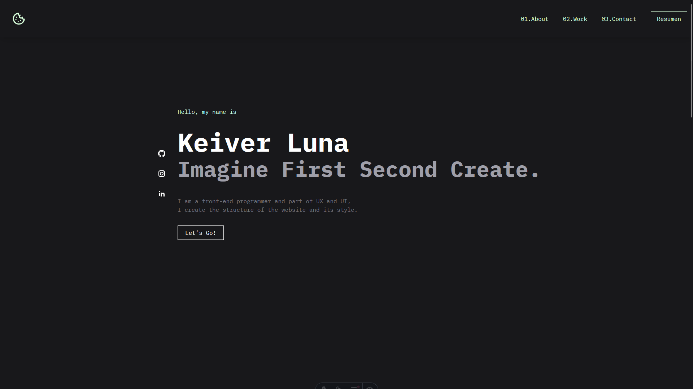

# 🌟 My Portafolio

This is my web portfolio built with **[React](https://vite.dev/)** and **[Tailwind](https://tailwindcss.com/)**

****

## 🚀 Technologies Used

- [React for Vite](https://vite.dev/)
- HTML / CSS - (Tailwind) / JavaScript / FrameMotion /
- Markdown / MDX (if used)..
---

## 📦 Requirements

Make sure you have installed

- [Node.js](https://nodejs.org/) v18 or higher
- [npm](https://www.npmjs.com/) or [pnpm](https://pnpm.io/)

---

## 📁 Project Structure

```
/
├── public/           # Static assets
├── src/       
│   ├── assests/      # Assest
│   ├── component/    # Structura Web
├── App.jsx           # App configuration
├── index.css         # Styles and Tailwind
├── main.jsx          # Root the App
├── package.json
```

---

## 🛠️ How to Start the Project

1. **Clone the repository**

```bash
git clone https://github.com/Keiver-Dev/Portafolio.git
cd Portafolio
npm run dev
```

2. **🧞 Commands**

All commands are run from the root of the project, from a terminal:

| Command                   | Action                                           |
| :------------------------ | :----------------------------------------------- |
| `npm install`             | Installs dependencies                            |
| `npm run dev`             | Starts local dev server at `localhost:`      |
| `npm run build`           | Build your production site to `./dist/`          |
| `npm run preview`         | Preview your build locally,

